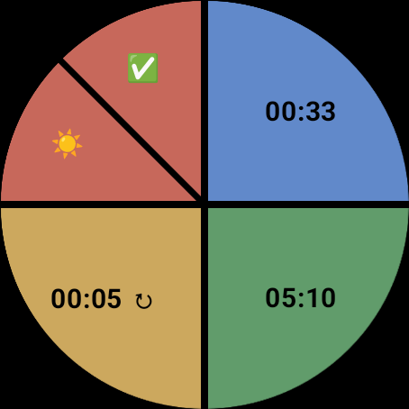

# TimeTwist

TimeTwist is a simple WearOS application designed to manage a limited set of timers. It's built with Kotlin and uses Jetpack Compose for the UI. The interface is very flat and currently there are only 3 timers able to be configured. 

Its most important feature is that vibration will occur periodically while the timer is running. The vibrations will be more sparse the longer the remaining duration of the timer and will occur every 5 seconds once there are 30 seconds or less remaining.

## Screenshots

This is the main timer view:


After pressing the `Edit` button, tap a timer to edit:



In edit mode, select minutes or seconds and drag the slider to set the number:


## ADB

The `adb` executable is located in
```
%LOCALAPPDATA%\Android\sdk\platform-tools
```

To list `adb` devices
```
adb devices
```

To force reinstall of the package, run
```
adb -s 192.168.2.224:37545 uninstall com.example.timetwist && adb -s 192.168.2.224:37545 install -r app-release.apk
```
