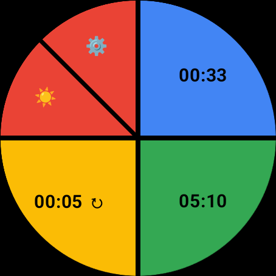
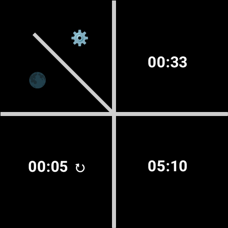

# TimeTwist

TimeTwist is a simple WearOS application designed to manage a limited set of timers. It's built with Kotlin and uses Jetpack Compose for the UI. The interface is very flat. It has 5 buttons, 3 of which are timers able to be configured. The four and five are an Edit mode toggle that allows you to edit a timer and a dark mode toggle. One unique thing I designed was a nice way to edit numerical values by dragging a circular slider around the edge of the screen.

TimeTwist's most important feature is that vibration will occur periodically while the timer is running. The vibrations will occur every 5 seconds if there are 30 seconds or less remaining and every 15 seconds otherwise. This reassures you that the timer is running.

## Play Store

You can find the app on the Play store here: https://play.google.com/store/apps/details?id=com.cgm.timetwist

## Screenshots

This is the main timer view:



After pressing the `Edit` button, tap a timer to edit:


In edit mode, select minutes or seconds and drag the slider to set the number:


Now with dark mode:




## ADB

On the watch, go to Settings -> Developer Options -> Wireless Debugging and find the `ip:port` item.

Add `adb` to your PATH, the executable is located in
```
%LOCALAPPDATA%\Android\sdk\platform-tools
```

To list `adb` devices
```
adb devices
```

If the `ip:port` entry for your watch is missing, run
```
adb connect 192.168.2.224:44923 
```

You may just be able to (re)install directly
```
adb -s 192.168.2.224:44923 install -r app\release\app-release.apk
```

To force reinstall of the package, run
```
adb -s 192.168.2.224:44923 uninstall com.cgm.timetwist && adb -s 192.168.2.224:44923 install -r app\release\app-release.apk
```
